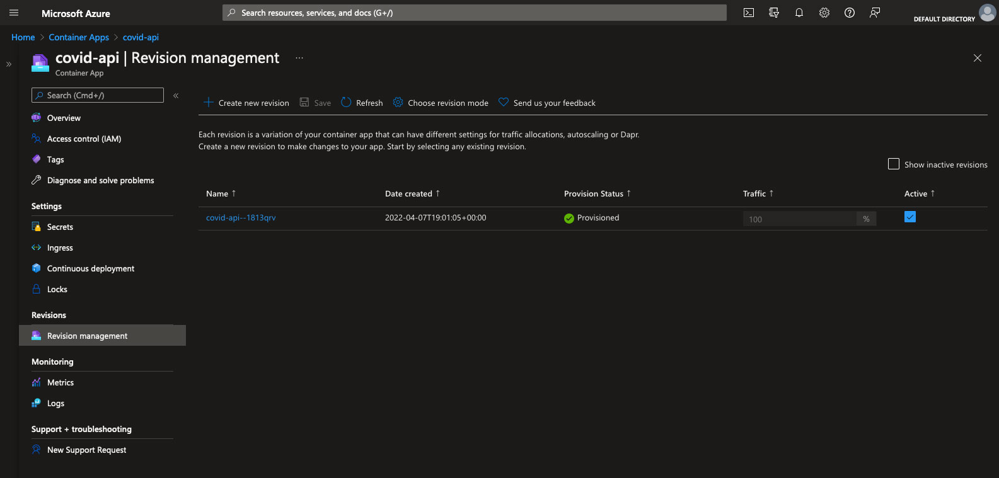

# Cloud Builder Live - April 2022

In this episode of Cloud Builder Live we will be using the [Azure Container Apps](https://docs.microsoft.com/en-us/azure/container-apps/) (in preview) to deploy a microservice REST API to query Covid-19 statistics around the world and then continuous deploy the entire thing from a GitHub repository.  We will also be using [Azure Load Testing](https://docs.microsoft.com/en-us/azure/load-testing/overview-what-is-azure-load-testing) (also in preview) to test scaling of our microservice.

## Watch it Live

This episode will air on April 12, 2022 at 6pm Eastern time.  It will be streamed on both [YouTube](https://www.youtube.com/watch?v=P1MzptEDmyc) and Twitch.  

## Branches

| Branch | Description |
| -------- | ---------- |
| *start* | This is the state of the repo at the beginning of the stream. This does not include the additional REST endpoint that is configured as well as the GitHub workflow file. |
| *end* | This is the state of the repo at the end of the stream.  This includes everything.    <i>**Note:** You will need to configure the GitHub workflow on your own from Azure Container Apps.  This will add necessary permissions and secrets.</i>

## Prerequisites

To follow along with this stream, you will need the following to be installed:

- Node.js ([download](https://nodejs.org/en/))
- Azure Subscription ([signup](https://azure.microsoft.com/en-us/free/search/))
- Azure CLI ([instructions](https://docs.microsoft.com/en-us/cli/azure/install-azure-cli))
- Docker ([install](https://www.docker.com/))
- ThunderClient for VSCode ([install](https://marketplace.visualstudio.com/items?itemName=rangav.vscode-thunder-client))

## Known Issues and Notes

It is important to know that at the time of the stream both Azure Container Apps and Azure Load Testing are in preview.  This means you may run across issues including the following:

- When preparing for this, I found that I had to manually edit the GitHub workflow to get it to trigger properly. I reported this in the following [issue](https://github.com/microsoft/azure-container-apps/issues/174).

## Data Notes

This data has been collected, aggregated, and documented by Cameron Appel, Diana Beltekian, Daniel Gavrilov, Charlie Giattino, Joe Hasell, Bobbie Macdonald, Edouard Mathieu, Esteban Ortiz-Ospina, Hannah Ritchie, Lucas Rodés-Guirao, Max Roser.

The mission of _Our World in Data_ is to make data and research on the world's largest problems understandable and accessible. [Read more about our mission](https://ourworldindata.org/about).

All visualizations, data, and code produced by _Our World in Data_ are completely open access under the [Creative Commons BY license](https://creativecommons.org/licenses/by/4.0/). You have the permission to use, distribute, and reproduce these in any medium, provided the source and authors are credited.

[COVID Data](https://github.com/owid/covid-19-data)
